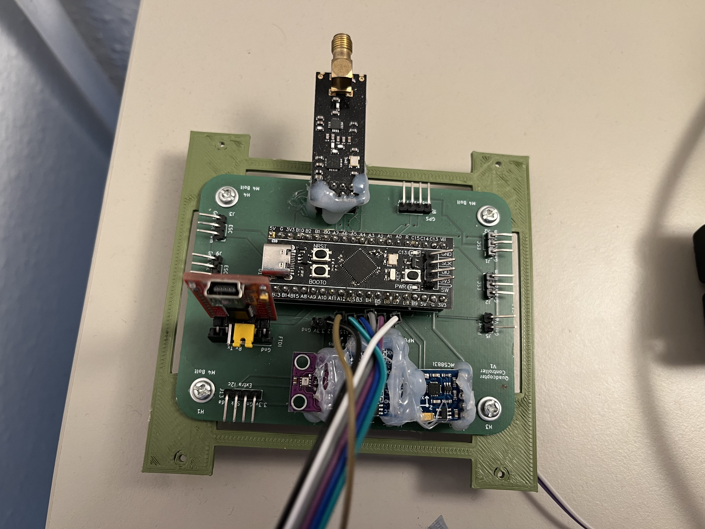
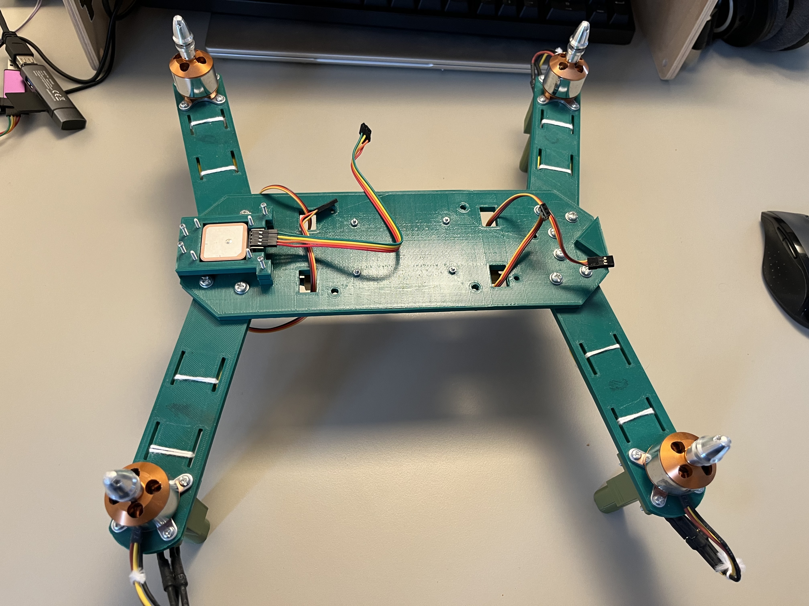
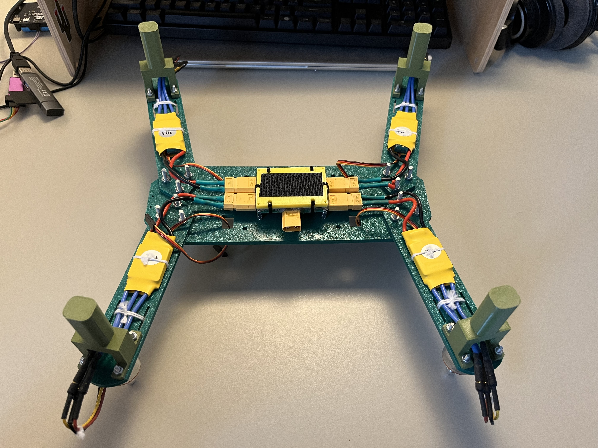
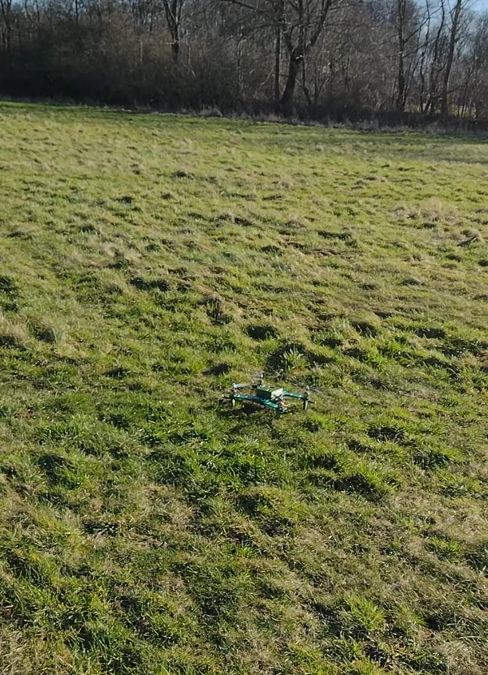

# STM32-Quadcopter

Work in progress. It does not fly yet, needs more work done to make it keep upright in the air.

STM32F411, MPU6050, QMC5883l, BN357, BMP280, NRF24l01, Second STM32F411 SD Logger

Link to SD logger repo: https://github.com/Rokas-embedded/Logger

## How it looks like

### Controller:

### Frame top:

### Frame bottom:

## Video of test 3 with problems
YT link: https://www.youtube.com/shorts/ODtNJZJHQQQ

ESC name "Cheetah HW30A Brushless ESC"
BEC from ESC powers the flight controller

## TODO lists

TODO after test 1:
* X Take off testing equipment as drone is too heavy to fly.
* X Uncomment second axis stabilization

TODO after test 2:
* X fix stuttering issue with motors. I think it is from receiving too little radio signals
* X figure out how to make screw nuts not undo themselves. Make the whole thing more rigid.
* X maybe upgrade to the extended range radio sensor
* X Make the robot turn off if it gets to an angle of like 45 degrees as that is not helping it hover

TODO after test 3:
* X Fix issues with remote restarting and roll joystick not making contact with pins.
* X Fix quadcopter event loop lag. Improve refresh rate of robot
* ! figure out how to use integral without super windup
* X remove comments from both remote and quadcopter.
* X add loop timing to remote to have constant refresh rate
* X Implement logging to sd card and log in a format that can be understood by something like betaflight blackbox analyzer
* X Make sure the motors never stop spinning at even at the lowest setting when controlled by the remote. This will help responsiveness.

TODO after test 4:
* ! Add blackbox logging for gps data
* ! Find out how to adjust what pwm frequency the esc accepts and change it from 50Hz to as fast as possible.
* ! The radio module caches the data sent durring the boot proccess of the quadcopter. Make sure the data is deleted before it gets to the pid loop as it is dangerous.
